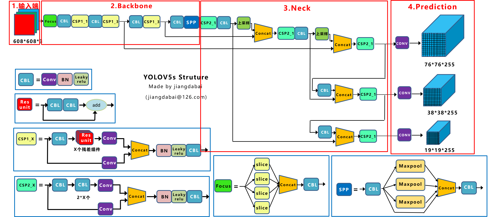

yoloV5 细节

YOLOV5总共有四种网络模型，分别是yoloV5s，yoloV5m，yoloV5l，yoloV5x

YOLOV5目前已经迭代到v3版本，我使用的是[v2版本](https://github.com/ultralytics/yolov5/tree/5e970d45c44fff11d1eb29bfc21bed9553abf986)

版本迭代信息，可以参考原repo

---

#### 1、YOLOV5网络结构

网络结构可视化可以使用[netron](https://github.com/lutzroeder/netron)工具

上图是yoloV5s的网络模型可视化结果

v5s是v5系列中深度最小，特征图宽度最小的网络

yoloV5的网络结构和yoloV4很相似，还是分为`输入端`，`Backbone`，`Neck`，`Prediction`四个部分

`输入端`：mosia数据增强，自适应anchor，自适应图片缩放

`Backbone`:Focus结构，CSP结构

`Prediction`:GIOU_Loss

Yolov5s网络最小，速度最少，AP精度也最低。但如果检测的以大目标为主，追求速度，倒也是个不错的选择。

其他的三种网络，在此基础上，不断加深加宽网络，AP精度也不断提升，但速度的消耗也在不断增加。

### 2 输入端

**（1）Mosaic数据增强**

Yolov5的输入端采用了和Yolov4一样的Mosaic数据增强的方式。

Mosaic数据增强提出的作者也是来自Yolov5团队的成员，不过，**随机缩放**、**随机裁剪**、**随机排布**的方式进行拼接，对于小目标的检测效果还是很不错的。

**（2） 自适应锚框计算**

在Yolo算法中，针对不同的数据集，都会有**初始设定长宽的锚框**。

在网络训练中，网络在初始锚框的基础上输出预测框，进而和**真实框groundtruth**进行比对，计算两者差距，再反向更新，**迭代网络参数**。

因此初始锚框也是比较重要的一部分，比如Yolov5在Coco数据集上初始设定的锚框：

在Yolov3、Yolov4中，训练不同的数据集时，计算初始锚框的值是通过单独的程序运行的。

但Yolov5中将此功能嵌入到代码中，每次训练时，自适应的计算不同训练集中的最佳锚框值。

当然，如果觉得计算的锚框效果不是很好，也可以在代码中将自动计算锚框功能**关闭**。

控制的代码即**train.py**中上面一行代码，设置成**False**，每次训练时，不会自动计算。

**（3）自适应图片缩放**

在常用的目标检测算法中，不同的图片长宽都不相同，因此常用的方式是将原始图片统一缩放到一个标准尺寸，再送入检测网络中。

比如Yolo算法中常用**416*416，608*608**等尺寸，比如对下面**800*600**的图像进行缩放。

但**Yolov5代码**中对此进行了改进，也是**Yolov5推理速度**能够很快的一个不错的trick。

作者认为，在项目实际使用时，很多图片的长宽比不同，因此缩放填充后，两端的黑边大小都不同，而如果填充的比较多，则存在信息冗余，影响推理速度。

因此在Yolov5的代码中datasets.py的letterbox函数中进行了修改，对原始图像**自适应的添加最少的黑边**。

图像高度上两端的黑边变少了，在推理时，计算量也会减少，即目标检测速度会得到提升。

这种方式在之前github上Yolov3中也进行了讨论：[https://github.com/ultralytics/yolov3/issues/232](https://link.zhihu.com/?target=https%3A//wx.qq.com/cgi-bin/mmwebwx-bin/webwxcheckurl%3Frequrl%3Dhttps%253A%252F%252Fgithub.com%252Fultralytics%252Fyolov3%252Fissues%252F232%26skey%3D%2540crypt_96d23a7c_7a713cdc64109256773c39e67ce4a665%26deviceid%3De850832231813449%26pass_ticket%3DTgSQoHNgevOIg9%25252B8R3aPNK%25252F5sw6ZIUuR2A96p1sbiAGBktXTseCh8r9U9jZAQojj%26opcode%3D2%26scene%3D1%26username%3D%408bbd87b4deb686cd79c1471b85752510)

在讨论中，通过这种简单的改进，推理速度得到了37%的提升，可以说效果很明显。

在**datasets.py的letterbox函数中**也有详细的代码。

**第一步：计算缩放比例**

原始缩放尺寸是416*416，都除以原始图像的尺寸后，可以得到0.52，和0.69两个缩放系数，选择小的缩放系数。

**第二步：计算缩放后的尺寸**

原始图片的长宽都乘以最小的缩放系数0.52，宽变成了416，而高变成了312。

**第三步：计算黑边填充数值**

将416-312=104，得到原本需要填充的高度。再采用numpy中np.mod取余数的方式，得到40个像素，再除以2，即得到图片高度两端需要填充的数值。

此外，需要注意的是：

a.这里填充的是黑色，即（0，0，0），而Yolov5中填充的是灰色，即（114,114,114），都是一样的效果。

b.训练时没有采用缩减黑边的方式，还是采用传统填充的方式，即缩放到416*416大小。只是在测试，使用模型推理时，才采用缩减黑边的方式，提高目标检测，推理的速度。

### 3 Backbone

**（1）Focus结构**

Focus结构，在Yolov3&Yolov4中并没有这个结构，其中比较关键是切片操作。

以Yolov5s的结构为例，原始608*608*3的图像输入Focus结构，采用切片操作，先变成304*304*12的特征图，再经过一次32个卷积核的卷积操作，最终变成304*304*32的特征图。

**需要注意的是**：Yolov5s的Focus结构最后使用了32个卷积核，而其他三种结构，使用的数量有所增加，先注意下，后面会讲解到四种结构的不同点。

**（2）CSP结构**

Yolov4网络结构中，借鉴了CSPNet的设计思路，在主干网络中设计了CSP结构。

Yolov5与Yolov4不同点在于，Yolov4中只有主干网络使用了CSP结构。

而Yolov5中设计了两种CSP结构，以**Yolov5s网络**为例，**CSP1_X结构**应用于**Backbone主干网络**，另一种**CSP2_X**结构则应用于**Neck**中。

### 4 Neck

Yolov5现在的Neck和Yolov4中一样，都采用FPN+PAN的结构，但在Yolov5刚出来时，只使用了FPN结构，后面才增加了PAN结构，此外网络中其他部分也进行了调整。

但如上面CSPNet结构中讲到，Yolov5和Yolov4的不同点在于，

Yolov4的Neck结构中，采用的都是普通的卷积操作。而Yolov5的Neck结构中，采用借鉴CSPnet设计的CSP2结构，加强网络特征融合的能力。

### 5 输出端

**（1）Bounding box损失函数**

Yolov5中采用其中的GIOU_Loss做Bounding box的损失函数。

而Yolov4中采用CIOU_Loss作为目标Bounding box的损失。

**（2）nms非极大值抑制**

在目标检测的后处理过程中，针对很多目标框的筛选，通常需要nms操作。

因为CIOU_Loss中包含影响因子v，涉及groudtruth的信息，而测试推理时，是没有groundtruth的。

所以Yolov4在DIOU_Loss的基础上采用DIOU_nms的方式，而Yolov5中采用加权nms的方式。

### 6.1 四种结构的参数

先取出Yolov5代码中，每个网络结构的两个参数：

**（1）Yolov5s.yaml**

**（2）Yolov5m.yaml**

**（3）Yolov5l.yaml**

**（4）Yolov5x.yaml**

四种结构就是通过上面的两个参数，来进行控制网络的**深度**和**宽度**。其中**depth_multiple**控制网络的**深度**，**width_multiple**控制网络的**宽度**。

### 6.2 Yolov5四种网络的深度

**（1）不同网络的深度**

**需要注意的是，四种网络结构中每个CSP结构的深度都是不同的。**

a.以yolov5s为例，第一个CSP1中，使用了1个残差组件，因此是**CSP1_1**。而在Yolov5m中，则增加了网络的深度，在第一个CSP1中，使用了2个残差组件，因此是**CSP1_2**。

而Yolov5l中，同样的位置，则使用了**3个残差组件**，Yolov5x中，使用了**4个残差组件**。

其余的第二个CSP1和第三个CSP1也是同样的原理。

b.在第二种CSP2结构中也是同样的方式，以第一个CSP2结构为例，Yolov5s组件中使用了2*1=2组卷积，因此是**CSP2_1**。

而Yolov5m中使用了2**组**，Yolov5l中使用了3**组**，Yolov5x中使用了4**组。**

其他的四个CSP2结构，也是同理。

Yolov5中，网络的不断加深，也在不断**增加网络特征提取**和**特征融合**的能力。

**（2）控制深度的代码**

控制四种网络结构的核心代码是**yolo.py**中下面的代码，存在两个变量，**n和gd**。

我们再将**n和gd**带入计算，看每种网络的变化结果。

**（3）验证控制深度的有效性**

我们选择**最小的yolov5s.yaml**和中间的**yolov5l.yaml**两个网络结构，将**gd(height_multiple)**系数带入，看是否正确。

### 2.3.4 Yolov5四种网络的宽度

**（1）不同网络的宽度:**

a.以Yolov5s结构为例，第一个Focus结构中，最后卷积操作时，卷积核的数量是32个，因此经过**Focus结构**，特征图的大小变成**304*304*32**。

而yolov5m的**Focus结构**中的卷积操作使用了48个卷积核，因此**Focus结构**后的特征图变成3**04*304*48**。yolov5l，yolov5x也是同样的原理。

b. 第二个卷积操作时，yolov5s使用了64个卷积核，因此得到的特征图是**152*152*64**。而yolov5m使用96个特征图，因此得到的特征图是**152*152*96**。yolov5l，yolov5x也是同理。

c. 后面三个卷积下采样操作也是同样的原理

四种不同结构的卷积核的数量不同，这也直接影响网络中，比如**CSP1，CSP2等结构**，以及各个普通卷积，卷积操作时的卷积核数量也同步在调整，影响整体网络的计算量。

当然卷积核的数量越多，特征图的厚度，即**宽度越宽**，网络提取特征的**学习能力也越强**。

**（2）控制宽度的代码**

在yolov5的代码中，控制宽度的核心代码是**yolo.py**文件里面的这一行：

它所调用的子函数**make_divisible**的功能是：

**（3）验证控制宽度的有效性**

我们还是选择**最小的yolov5s**和**中间的yolov5l**两个网络结构，将**width_multiple**系数带入，看是否正确。

**a. yolov5x.yaml**

其中**width_multiple=0.5**，即**gw=0.5**。

以第一个卷积下采样为例，即Focus结构中下面的卷积操作。

按照上面Backbone的信息，我们知道Focus中，标准的c2=64，而**gw=0.5**，代入（2）中的计算公式，最后的结果=32。即Yolov5s的Focus结构中，卷积下采样操作的卷积核数量为**32个。**

再计算后面的第二个卷积下采样操作，标准c2的值=128，**gw=0.5**，代入（2）中公式，最后的结果=64，也是正确的。

**b. yolov5l.yaml**

其中**width_multiple=1**，即**gw=1**，而标准的**c2=64**，代入上面（2）的计算公式中，可以得到Yolov5l的Focus结构中，卷积下采样操作的卷积核的数量为64个，而第二个卷积下采样的卷积核数量是128个。

另外的三个卷积下采样操作，以及**yolov5m，yolov5x结构**也是同样的计算方式

## 3 Yolov5相关论文及代码

### 3.1 代码

Yolov5的作者并没有发表论文，因此只能从代码角度进行分析。

大家可以根据网页的说明，下载训练，及测试，流程还是比较简单的。

### 3.2 相关论文

另外一篇论文，**PP-Yolo**，在Yolov3的原理上，采用了很多的**tricks调参方式**，也挺有意思。

感兴趣的话可以参照另一个博主的文章：[点击查看](https://link.zhihu.com/?target=https%3A//mp.weixin.qq.com/s/pHOFqFihkkRVTYbkSTlG4w)

